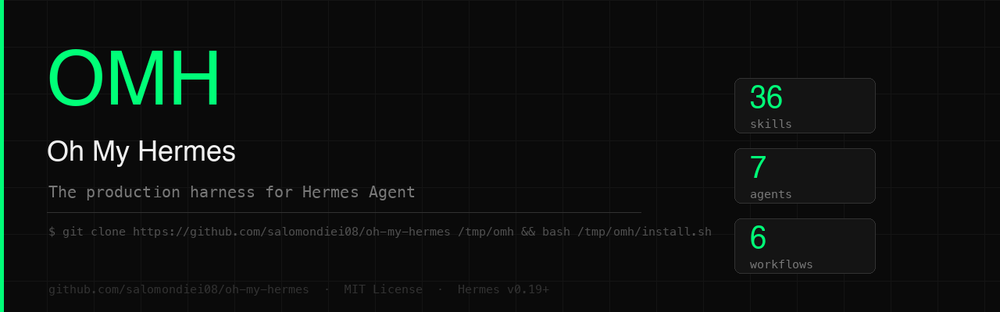

# OMH — Oh My Hermes

[](https://github.com/salomondiei08/oh-my-hermes/stargazers)
[](LICENSE)
[](https://hermes-agent.nousresearch.com)
[](#skills)
[](#agents)

**The production harness for Hermes Agent. 37 skills, 7 agents, 6 workflows — installed in one command.**

Like Oh My Zsh is to Zsh. Hermes has the primitives: memory, kanban, cron, profiles, subagents. Oh My Hermes wires them into a real product-building loop — from idea through design, build, review, deploy, and monitoring — with you in control of the irreversible decisions.

---

## Install

```bash
git clone https://github.com/salomondiei08/oh-my-hermes /tmp/omh
bash /tmp/omh/install.sh
```

Then tell your Hermes bot:

```
set up the CTO loop
```

Hermes reads the project, asks at most three questions with defaults, and starts the loop.

---

## Use with a coding agent

Paste this into Claude, Cursor, Copilot, or any coding assistant:

```
Install Oh My Hermes by running:
git clone https://github.com/salomondiei08/oh-my-hermes /tmp/omh && bash /tmp/omh/install.sh

Then read the full installation guide at:
https://github.com/salomondiei08/oh-my-hermes/blob/main/INSTALL_FOR_AGENTS.md

And follow the instructions there.
```

---

## The loop

```
Understand → Design → Build → Check → Ship → Learn
```

The CTO coordinates seven agents through Hermes Kanban. Work starts from an idea, customer feedback, production logs, or a GitHub issue — not from a fixed PR workflow.

```
Founder
  │
  └── CTO  ← lifecycle, roadmap, delegation, decisions
        │
        ├── Product     brief, priorities, SEO, content
        ├── Designer    UX, visual verification, launch media
        ├── Builder     working product increments
        ├── Reviewer    journeys, visual checks, PR review
        ├── Security    release risk, daily/weekly assessment
        └── Ops         deploy, health, logs, incidents
```

Hermes runs on your VPS or laptop. You interact from your phone via Telegram, Slack, Discord, or WhatsApp.

---

## Quick start

| Step | What to do | What you get |
|---|---|---|
| 1 | Install Hermes + connect Telegram | A bot you can message |
| 2 | Run `install.sh` | 37 skills and 6 workflows loaded |
| 3 | Message: "set up the CTO loop" | Bot sets up profiles, kanban, and crons in chat |
| 4 | Connect GitHub when useful | Issue triage and PR delivery enabled |
| 5 | Add production URL after first deploy | Health checks and log observation enabled |
| 6 | `/goal Build and ship [product]` | Agent stays focused across long sessions |
| — | Autonomous from here | Daily reports, health checks, security, log observation |

---

## Skills

### Product

| Skill | What Hermes does |
|---|---|
| `onboarding` | Infers setup, asks at most three questions, avoids duplicate crons |
| `clarify-requirements` | Reads first, asks only material questions, continues with defaults |
| `product-brief` | Writes the compact source of truth and acceptance criteria |
| `design-handoff` | Designer creates `DESIGN.md` and verifies implemented UI |
| `product-marketing` | Positioning, website copy, SEO, launch strategy, content schedule |
| `creative-production` | Product assets and HyperFrames launch video with licensed music evidence |
| `computer-use` | Operates native/authenticated GUI only when simpler tools cannot |

### Build

| Skill | What Hermes does |
|---|---|
| `choose-engine` | Routes tasks to Hermes, Claude Code, or Codex |
| `implement-with-claude-code` | Scaffolds Claude Code with full context + scope constraints |
| `implement-with-codex` | Scaffolds Codex for targeted single-file fixes |
| `create-skill` | Creates a new skill in the correct format (meta-skill) |

### Deliver

| Skill | What Hermes does |
|---|---|
| `deploy-to-vercel` | Pre-deploy checks → deploy → capture URL |
| `connect-supabase` | Links Supabase, pushes migrations, sets Vercel env vars |
| `setup-monitoring` | Configures Sentry + Uptime Kuma |
| `health-check` | Three-layer check: app endpoint, Supabase connection, Vercel logs |
| `post-deploy-followup` | Health check + deployment log + notification + summary |
| `rollback` | Rolls back Vercel production after health failure — requires founder YES |

### Operate

| Skill | What Hermes does |
|---|---|
| `observe-logs` | Deduplicates runtime errors, escalates only actionable changes |
| `send-notification` | Gateway-first founder messaging with durable delivery (v0.19+) |
| `cto-status-report` | Daily morning report: shipped, in progress, blocked |
| `backup-hermes-data` | Tarballs `~/.hermes/` to S3, Dropbox, or local |
| `failure-recovery` | Saves failed cron/agent context to dead-letter logs and alerts |
| `reset-runtime` | Backs up and clears stale Hermes state without deleting credentials |
| `server-bootstrap` | Sets up a fresh VPS with Hermes, Telegram, and the CTO loop |
| `automation-blueprint` | Saves multi-step recurring tasks as named, parameterized blueprints |

### GitHub

| Skill | What Hermes does |
|---|---|
| `manage-github-issues` | Triage, create, label, assign, and close issues |
| `create-github-pr` | Creates PR with secret scan before opening |
| `auto-issue-triage` | Hourly: scores open issues, picks top priority, starts work |
| `review-github-pr` | Verifies the product increment, approves or requests changes |
| `await-merge-approval` | Founder chooses YES, NO, CLOSE, or LATER — durably delivered |
| `security-review` | Tool-backed release gate plus daily and weekly assessments |

### Creative

| Skill | What Hermes does |
|---|---|
| `generate-with-seedance` | Approved paid video shots through the Volcengine Ark API |
| `publish-with-buffer` | Dry-runs and schedules approved posts through the Buffer CLI |

### Project

| Skill | What Hermes does |
|---|---|
| `project-switch` | Switches product context without mixing memory, crons, or approvals |
| `project-status` | Founder-readable status: gateway, model, project, crons, integrations |
| `ship-this-idea` | Runs the full idea → brief → design → build → verify → ship flow |
| `kanban-task` | Creates and updates Hermes kanban cards at every stage |

---

## Agents

Seven focused agents, seven Hermes profiles. Created by `setup-cto.sh` or by messaging "set up the CTO loop".

| Agent | Profile | Owns |
|---|---|---|
| CTO | `cto` | Lifecycle, roadmap, delegation, founder communication |
| Product | `pm` | Brief, priorities, positioning, SEO, content strategy |
| Designer | `designer` | UX, visual verification, launch media |
| Builder | `dev` | Working product increments and implementation evidence |
| Reviewer | `qa` | User journeys, visual/accessibility checks, PR review |
| Security | `security` | Release risk and recurring security assessment |
| Ops | `ops` | Deployments, health, logs, incidents, rollback proposals |

---

## Workflows

| Workflow | What it does |
|---|---|
| `cto-loop` | Full product lifecycle — Understand, Design, Build, Check, Ship, Learn |
| `idea-to-deploy` | From minimal clarification to a deployed, monitored product |
| `ship-this-idea` | One founder sentence → brief, build, verify, deploy |
| `design-to-code` | Designer defines and verifies; Builder implements |
| `deploy-and-monitor` | Deploy → health check → log observation → notify |
| `github-ops` | Issue triage, PR review, and merge flow |

---

## Workflow examples

**Start a new project:**
```
you: start a new app
hermes: Found stack and existing context. Two choices that materially affect V1,
        with recommended defaults. Skip them and I'll continue with defaults.
you: use the defaults
hermes: PRODUCT_BRIEF.md and DESIGN.md are ready. Starting the first build increment.
```

**Deploy:**
```
you: deploy this to Vercel
hermes: Running pre-deploy checklist…
hermes: Deployed. URL: https://myapp.vercel.app
hermes: Health check: PASS (200ms). Notification sent.
```

**Quick fix:**
```
you: fix the auth redirect bug in src/middleware.ts
hermes: Routing to Codex (single-file fix)…
hermes: Done. Typecheck passes. PR created.
hermes: Preview healthy. Reply YES to ship, NO with feedback, CLOSE, or LATER.
```

**Stacked skills (v0.19+):**
```
you: /clarify-requirements /product-brief build a dashboard for active users
hermes: [runs both skills in sequence without a round-trip]
```

---

## Running on a VPS

Intended for production — Hermes runs 24/7, crons fire automatically, you interact from your phone:

```bash
# $5/month VPS (Ubuntu 22.04+)
curl -fsSL https://raw.githubusercontent.com/NousResearch/hermes-agent/main/scripts/install.sh | bash
hermes setup     # full configuration wizard (v0.19+)
hermes gateway setup && hermes gateway start   # connect Telegram or Slack

# Install Oh My Hermes
git clone https://github.com/salomondiei08/oh-my-hermes /tmp/omh
bash /tmp/omh/install.sh

# Message your bot: "set up the CTO loop"
```

For a completely fresh server:
```bash
bash ~/.hermes/scripts/server-bootstrap.sh --project myapp --repo owner/repo --telegram
```

---

## Optional credentials — only when needed

Oh My Hermes does not ask for every service during onboarding. Credentials are stored in `~/.hermes/.env` with user-only permissions and requested at first use:

```bash
bash ~/.hermes/scripts/setup-integrations.sh --check      # see what is and isn't configured
bash ~/.hermes/scripts/setup-integrations.sh --buffer     # configure Buffer
bash ~/.hermes/scripts/setup-integrations.sh --seedance   # configure Seedance
bash ~/.hermes/scripts/setup-integrations.sh --openai     # configure OpenAI
```

If you use Bitwarden or 1Password, run `hermes secrets` to plug your vault in directly. Never paste credentials into chat.

---

## Scripts

| Script | What it does |
|---|---|
| `install.sh` | Installs all skills, workflows, and agent definitions |
| `scripts/bootstrap.sh` | Creates `AGENTS.md`, `.env.example`, health endpoint in a project |
| `scripts/setup-cto.sh` | Creates profiles, initializes kanban, schedules crons |
| `scripts/setup-integrations.sh` | Securely configures optional OpenAI, Buffer, and Seedance credentials |
| `scripts/server-bootstrap.sh` | Fresh VPS setup: Hermes + Oh My Hermes + Telegram |
| `scripts/project.sh` | Switches current product context |
| `scripts/status.sh` | Prints founder-readable project and integration status |
| `scripts/run-cron-safe.sh` | Wraps cron jobs with dead-letter logging on failure |
| `scripts/reset-runtime.sh` | Backs up and clears stale sessions and state |
| `scripts/ship-this-idea.sh` | Starts the full flagship build flow from one sentence |
| `scripts/verify.sh` | Checks everything is installed correctly |
| `scripts/uninstall.sh` | Removes all Oh My Hermes files from `~/.hermes/` |

---

## Architecture

```
oh-my-hermes/
├── skills/          ← 37 skill files → ~/.hermes/skills/
├── workflows/       ← 6 workflow files → ~/.hermes/workflows/
├── agents/          ← 7 agent role definitions → ~/.hermes/agents/
├── templates/       ← AGENTS.md template, .env example, health endpoint
├── scripts/         ← install, bootstrap, status, switch, reset, setup, verify
└── docs/            ← Full documentation
```

See [docs/architecture.md](docs/architecture.md) for the memory key registry, approval boundary, and execution model.

---

## Optional: GBrain memory backbone

[GBrain](https://github.com/garrytan/gbrain) gives Hermes a richer, self-updating knowledge graph — people, companies, decisions, deployment history — queryable across sessions.

```bash
git clone https://github.com/garrytan/gbrain.git ~/gbrain && cd ~/gbrain
curl -fsSL https://bun.sh/install | bash && export PATH="$HOME/.bun/bin:$PATH"
bun install && bun link && gbrain init
```

Do not use `npm install -g gbrain` — a squatter package exists on npm under that name.

---

## Roadmap

**V1 — current:** 37 skills, 7 agents, 6 workflows. Optional-question onboarding, project switching, status, dead-letter recovery, product design, computer use policy, recurring security and log observation, creative launch production, fresh-server setup, Vercel + Supabase + GitHub delivery, automation blueprints.

**V2 — planned:** Staging-to-production promotion, broader provider adapters, post-deploy journey tests.

**V3 — planned:** Multi-service orchestration, more example apps, hosted setup wizard.

---

## Contributing

Read [docs/architecture.md](docs/architecture.md) before proposing features. Open issues for wrong or missing skills, bugs in scripts, or Hermes improvement proposals.

---

## License

MIT
